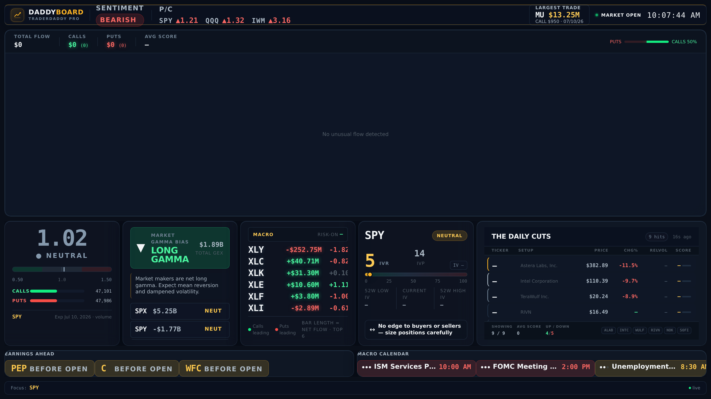
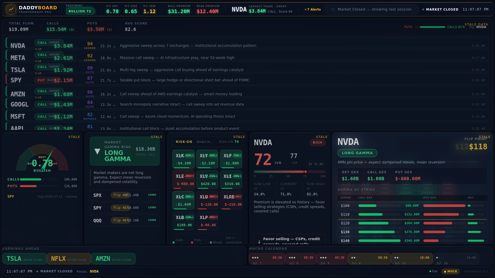

# DaddyBoard

An always-on **TraderDaddy Pro wall display**. Hang a spare monitor or TV on the
wall, point a Raspberry Pi at it, and DaddyBoard shows a glanceable-from-10-feet
dark dashboard of what smart money is doing right now — a live options-flow tape,
market vitals, gamma, sector rotation, sentiment, IV rank, screener setups, and
what's coming on the calendar.

It reads **your own `td_live_` API key** from a local file and talks only to the
public TraderDaddy Pro MCP endpoint (read-only). No login, no website, no account
surface — it's an appliance.

**Live mode** — your own account's data on the wall:



**Demo mode** (`npm run mock`) — realistic sample data, no key required:



---

## Powered by TraderDaddy Pro

DaddyBoard is a companion appliance for **[TraderDaddy Pro](https://traderdaddy.pro)** —
the options-flow and smart-money platform. Every panel here is a live read of the
same institutional data pros pay for: real-time unusual options activity, gamma
exposure, sector rotation, IV rank, and curated screener setups.

- **See the smart money.** The hero tape is a live feed of large, aggressive
  options prints — the trades that move markets, as they hit.
- **Glanceable edge.** Gamma bias, put/call sentiment, and IV rank tell you the
  regime at a glance, from across the room.
- **Setups on rotation.** The main stage cycles TraderDaddy's screeners and
  strategy ideas so there's always something actionable on the wall.

Don't have a key yet? Start with **demo mode** below, then grab an API key at
**[traderdaddy.pro](https://traderdaddy.pro)** (Developer API access on your plan)
to light it up with your own live data.

---

## What it shows

| Region | Panel | Source tool |
|---|---|---|
| Header | Market vitals (put/call, sentiment, largest trade) + live clock/phase | `get_market_stats` |
| Hero | **Unusual-activity flow tape** — the smart-money feed | `get_unusual_activity` |
| Grid | Sentiment gauge · Gamma bias · Sector heatmap · IV-rank watch | `get_put_call_ratios`, `get_gex_overview`, `get_sector_flow`, `get_iv_rank` |
| Main stage (rotates) | Screener setups · Strategy ideas · Edge X-ray · Ticker gamma ladder | `run_screener`, `get_strategy_ideas`, `get_edge_xray`, `get_gex_ticker` |
| Ribbon | What's coming: earnings + econ calendar | `get_earnings_flow`, `get_economic_calendar` |

The heavier deep-dive panels follow the day's **hottest ticker** automatically
(derived from the top flow row).

---

## Quick start

Requires **Node ≥ 20**.

```bash
cd DaddyBoard
npm install
```

### Demo mode (no API key)

Renders realistic sample data — great for a screenshot or a first look:

```bash
npm run mock
```

Open **http://localhost:4321** and press F11 (full screen). A **DEMO** badge
shows so sample data is never mistaken for live.

### Live mode (your data)

1. Get your `td_live_` key from your TraderDaddy Pro account (Developer API — you
   need API access on your plan).
2. Copy the config and add your key:
   ```bash
   cp config.example.json config.json
   # edit config.json, set "apiKey": "td_live_..."
   ```
   `config.json` is gitignored and never leaves the device.
3. Start it:
   ```bash
   npm start
   ```

---

## Configuration (`config.json`)

| Key | Default | What it does |
|---|---|---|
| `apiKey` | — | Your `td_live_` key (required in live mode). |
| `baseUrl` | `https://api.traderdaddy.pro` | TraderDaddy Pro API origin. |
| `port` | `4321` | Local port the display is served on. |
| `mockMode` | `false` | Force demo fixtures (or set env `MOCK_MODE=true`). |
| `featuredTickers` | `["SPY","QQQ","NVDA"]` | Fallback symbols for the deep-dive when flow is quiet. |
| `screenerRotation` | `["daily-cuts","momentum","csp-wheel","volatility-squeeze"]` | Screeners the feature card cycles through. |
| `rotationSeconds` | `20` | How long each rotating stage panel is shown. |
| `timezone` | `America/New_York` | Market-hours clock. |

Env overrides: `MOCK_MODE`, `PORT`, `TD_API_KEY`, `TD_BASE_URL`.

The rotation interval can also be tuned live via the `data-rotation` attribute on
`<html>` in `public/index.html`.

It's **market-hours aware**: fast pollers only run while the market is open; when
closed it calms the layout, keeps the last session's values, and refreshes the
calendar occasionally. It respects the per-key rate limit and backs off on 429.

---

## Raspberry Pi kiosk setup

Turn a Pi + monitor into a permanent wall display. Tested shape (Raspberry Pi OS,
Chromium):

**1. Install Node 20+ and the app**
```bash
sudo apt update && sudo apt install -y nodejs npm chromium-browser unclutter
cd ~/DaddyBoard && npm install
cp config.example.json config.json   # add your td_live_ key
```

**2. Run the daemon on boot** — `~/.config/systemd/user/daddyboard.service`:
```ini
[Unit]
Description=DaddyBoard daemon
After=network-online.target

[Service]
WorkingDirectory=%h/DaddyBoard
ExecStart=/usr/bin/node src/server.js
Restart=always

[Install]
WantedBy=default.target
```
```bash
systemctl --user enable --now daddyboard.service
loginctl enable-linger "$USER"   # so it runs without an interactive login
```

**3. Launch Chromium in kiosk mode on the desktop autostart** —
`~/.config/lxsession/LXDE-pi/autostart` (or your DE's autostart):
```
@xset s off
@xset -dpms
@xset s noblank
@unclutter -idle 0
@chromium-browser --kiosk --incognito --noerrdialogs --disable-infobars --check-for-update-interval=31536000 http://localhost:4321
```

`--kiosk` = full screen no chrome; `unclutter` hides the mouse; the `xset` lines
stop the screen blanking. Reboot and the wall lights up on its own.

> Tip: to auto-sleep the panel outside market hours, add a cron job that runs
> `xset dpms force off` in the evening and `xset dpms force on` at ~9:00 ET.

---

## How it works

```
config.json (your td_live_ key)
        │
   ┌────▼─────────────────────────────┐
   │ Node daemon (src/)               │
   │  • mcpClient  JSON-RPC → /api/v1/mcp
   │  • poller     market-hours schedule, cache, 429 backoff
   │  • server     serves /api/state + static client
   └────┬─────────────────────────────┘
        │  GET /api/state  (polled every 5s)
   ┌────▼─────────────────────────────┐
   │ Vanilla client (public/)         │
   │  • app.js  registry + rotation + chrome
   │  • panels/*.js  one self-registering module each
   │  • styles/tokens.css  design system
   └──────────────────────────────────┘
```

No build step, no framework, no bundler — plain ES modules the browser loads
directly, so it runs comfortably on a Pi.

---

## Notes

- **Read-only.** DaddyBoard never places trades or writes anything. It only reads
  the public MCP tools your key already has access to.
- **Your key stays local.** It lives in `config.json` on the device and is sent
  only to `baseUrl`.
- Signal/accuracy data shown is for your own glanceable use — keep the wall
  somewhere you trust.
